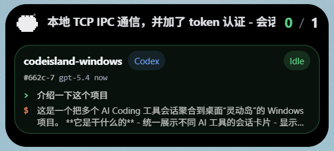
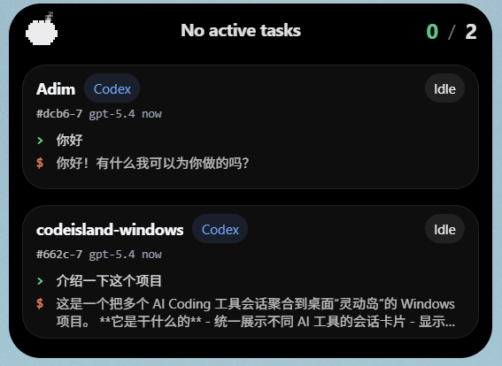

# EchoIsland — AI 编码工作流的灵动岛

<p align="center">
  
</p>

> **EchoIsland 是一个免费、开源的灵动岛风格桌面聚合工具，将 Codex、Claude Code、OpenClaw 以及未来更多 AI 编码工具的会话统一到一个轻量悬浮界面中。项目以 Windows 为优先平台，正在积极迁移 macOS 原生灵动岛支持，并基于 Tauri + Rust 构建本地优先的轻量运行时。**

<p align="center">
  <a href="./LICENSE"></a>
  
  
  <a href="https://github.com/FunplayAI/EchoIsland"></a>
</p>

<p align="center">
  <a href="./README.md">English</a> · <a href="./README.zh-CN.md">简体中文</a>
</p>

---

## 问题：多工具并行的隐性成本

AI 编码工具的普及带来了一个新的效率瓶颈：**多工具碎片化**。

JetBrains 2023 开发者生态调查显示，超过 50% 的开发者已经开始使用 AI 编码助手。随着 Codex、Claude Code、Cursor 等工具的成熟，很多开发者会同时运行两到三个——每个工具各自独立运行在自己的终端窗口里，各有各的审批流程，各有各的对话上下文。

加州大学欧文分校 Gloria Mark 教授的研究发现，人在被打断后平均需要 **23 分 15 秒** 才能重新回到之前的任务状态（[Mark, Gudith & Klocke, "The Cost of Interrupted Work: More Speed and Stress," CHI 2008](https://dl.acm.org/doi/10.1145/1357054.1357072)）。每一次在 AI 工具窗口之间切换，你都在支付这个成本。

具体表现为：
- Codex 在等你审批，你在看 Claude Code 的输出，根本没注意到
- 对话上下文分散在不同的终端里，切换后要花时间重新定位
- 会话中断后，很难快速找回之前的状态

## 解决方案

EchoIsland 是一个**轻量的桌面聚合层**——不是又一个编辑器，不是又一个聊天窗口。它以灵动岛风格的悬浮条驻留在桌面顶部，把你现有工具的状态统一展示和管理：

| 功能 | 说明 |
|:---|:---|
| **统一会话视图** | 一个悬浮条看到所有活跃的 AI 会话 |
| **集中处理动作** | 审批、提问、完成提醒在一个地方统一处理 |
| **即时上下文** | 不切窗口就能看到每个工具最新的 prompt 和回复 |
| **终端跳转** | 一键跳回对应的终端窗口 |
| **会话持久化** | 自动快照，崩溃或重启后恢复会话状态 |

## 界面预览

| 悬浮条 | 审批 / 提问 | 会话总览 |
|:---:|:---:|:---:|
|  |  |  |
| 紧凑的桌面顶部入口，实时感知任务状态 | 统一承接各工具的审批和问题 | 聚合会话列表，含来源、状态和最近上下文 |

## 当前开发状态

| 模块 | 状态 | 说明 |
|:---|:---|:---|
| **Windows 桌面端** | ✅ 主平台 | 默认启用 Direct2D/DirectWrite 原生灵动岛，支持安装包和便携版构建 |
| **macOS 原生灵动岛** | 🧪 迁移中 | 原生面板、刘海适配、终端跳转、共享 runtime |
| **Linux 桌面端** | 🧭 暂未打包 | Rust 核心可移植，桌面壳暂非优先级 |
| **本地优先运行时** | ✅ 可用 | TCP IPC、HTTP receiver、持久化、阻塞请求收尾 |

## 竞品对比

| 特性 | EchoIsland | Nimbalyst | Vibe Island |
|:---|:---|:---|:---|
| **技术架构** | Tauri + Rust | Electron | Swift |
| **内存占用** | **< 50MB** ¹ | ~200MB | < 50MB |
| **开源** | ✅ MIT | ❌ | ❌ |
| **交互方式** | 灵动岛悬浮条 | 看板 + 富文本编辑器 | 刘海面板 |
| **平台** | **Windows** / macOS 实验支持 | macOS / Windows / Linux | 仅 macOS |
| **会话持久化** | ✅ 自动快照 + 恢复 | ✅ | ❌ |
| **可视化编辑** | ❌（纯聚合层）| ✅ Markdown / 模型 / 代码 | ❌ |
| **移动端** | ❌ | ✅ iOS | ❌ |
| **价格** | **免费** | 免费 | 一次性购买 |

> ¹ Tauri 使用操作系统原生 webview 而非打包 Chromium，内存占用比 Electron 方案低 50–80%（[Tauri 架构说明](https://tauri.app/concept/architecture/)）。

**最适合**：需要一个轻量的、始终在线的会话感知层——而不是完整工作空间——的开发者。灵动岛风格的快速访问，Rust 级性能，零云端依赖。项目仍以 Windows 为优先平台，同时正在积极迁移 macOS 原生体验。

## 工作原理

```
AI 工具 / hooks / 本地会话文件
                │
                ▼
           adapters         ← 工具适配器（Codex, Claude Code, ...）
                │
                ▼
              ipc            ← 本地 TCP + token 认证（延迟 < 2ms）
                │
                ▼
            runtime          ← 会话状态机 + 事件聚合
                │
        ┌───────┴────────┐
        ▼                ▼
      core         persistence  ← 快照 + 自动恢复
        │
        ▼
   desktop UI        ← Tauri 悬浮岛界面
```

两条主要输入链路：

1. **实时事件链路** — 工具事件通过 `hook-bridge` → `ipc` → `runtime` 传入
2. **降级扫描链路** — 当实时 hook 不可用时，自动扫描本地会话文件提取最近对话和状态

## 当前能力

- 统一事件协议和会话状态机
- 本地 TCP IPC 与 HTTP receiver，均使用 token 认证
- bridge / peer 断开时自动清理阻塞中的审批和提问请求
- 会话快照与持久化恢复
- 30 分钟无活动会话自动清理
- Codex 与 Claude Code 会话扫描，自适应轮询
- 审批卡片、提问卡片、完成提醒和消息队列
- Windows 终端跳转，以及实验中的 macOS 终端跳转
- Windows Direct2D/DirectWrite 原生灵动岛面板默认启用
- macOS 原生灵动岛面板与刘海感知布局（实验中）
- `desktop-host` 调试 CLI 和 `hook-bridge` 桥接程序
- Windows NSIS / MSI 安装包生成

## 已支持的集成

| 来源 | 状态 | 说明 |
|:---|:---|:---|
| **Codex** 本地会话 | ✅ 可用 | 扫描 Codex 历史和会话文件获取最近状态 |
| **Codex** hooks | ⚠️ 部分可用 | hook 安装和状态检测可用；Windows 实时 hook 仍受上游 Codex 运行时行为限制 |
| **Claude Code** 本地会话 | ✅ 可用 | 扫描 `~/.claude/projects` transcript，并自适应轮询 |
| **Claude Code** hooks | ✅ 可用 | 通过 `~/.claude/settings.json` 安装全局 hooks，并经由 `hook-bridge` 转发 |
| **OpenClaw** hooks | ✅ 可用 | 安装 hook pack，并通过本地 HTTP receiver 转发事件 |
| **Cursor** | 🧭 预留 | 协议层预留，后续扩展 |

## 快速开始

### 环境要求

- Windows 10/11，或用于测试实验性原生灵动岛的 macOS
- Rust 工具链
- Node.js + npm

### 启动桌面应用

```bash
npm run desktop:dev
```

在 Windows PowerShell 中也可以使用 `npm.cmd run desktop:dev`。

### 启动本地调试宿主

```powershell
cargo run -p desktop-host
```

### 扫描本地会话

```bash
cargo run -p desktop-host -- codex-scan
cargo run -p desktop-host -- claude-scan
```

### 安装 Hook 适配器

先构建 bridge，再按需安装适配器：

```bash
cargo build -p echoisland-hook-bridge
cargo run -p desktop-host -- install-codex
cargo run -p desktop-host -- install-claude
cargo run -p desktop-host -- install-openclaw
```

### 构建安装包

```bash
npm run desktop:build
```

生成的安装包：
- `EchoIsland Windows_0.2.0_x64-setup.exe`（NSIS）
- `EchoIsland Windows_0.2.0_x64_en-US.msi`（MSI）

构建 Windows 便携版可执行文件：

```bash
npm --workspace apps/desktop run tauri:portable
```

## 项目结构

```
apps/
  desktop/         → Tauri 桌面应用
  desktop-host/    → 本地调试宿主 / CLI
  hook-bridge/     → Hook 事件转发桥接

crates/
  adapters/        → 工具适配器与扫描逻辑
  core/            → 协议、状态机、派生状态
  ipc/             → 本地 TCP IPC
  persistence/     → 会话持久化
  runtime/         → 运行时编排与事件聚合

samples/           → 测试用样例事件
```

## 谁适合用 EchoIsland？

- **多工具开发者** — 同时使用 Codex + Claude Code + Cursor 的人
- **终端重度用户** — 希望减少窗口切换，更专注于键盘驱动的工作流
- **Windows 开发者** — 这个品类终于有了 Windows 原生方案（不再只有 macOS）
- **macOS 测试用户** — 帮助验证实验中的原生灵动岛和终端跳转体验
- **工程团队** — 在探索 AI 编码工作流聚合模式的团队
- **开源开发者** — 可参考的 本地桌面宿主 + Rust 运行时 架构

## 常见问题

### EchoIsland 是什么？

EchoIsland 是一个免费、开源的 Windows 桌面聚合工具，将多个 AI 编码工具（Codex、Claude Code、Cursor）的会话统一到一个悬浮岛风格的界面中。基于 Tauri + Rust 构建，使用系统原生 webview，内存占用不到 50MB——远轻于 Electron 方案。

### EchoIsland 和 Nimbalyst 有什么区别？

Nimbalyst 是基于 Electron 的可视化工作空间，提供看板式会话管理、富文本编辑器（Markdown、模型、代码）和 iOS 移动端。EchoIsland 走的是完全不同的路线：基于 Tauri + Rust 的轻量聚合层（< 50MB vs Nimbalyst 的 ~200MB），用灵动岛风格的悬浮条实现快速会话感知和终端跳转，而不是可视化编辑。EchoIsland 是 MIT 完全开源的，Nimbalyst 不是。

### EchoIsland 和 Vibe Island 有什么区别？

Vibe Island 是一个仅支持 macOS 的 Swift 原生应用，在 MacBook 刘海位置显示 AI 代理状态。EchoIsland 把类似的灵动岛交互带到了 Windows，并且是 MIT 完全开源的。如果你在 Windows 上，EchoIsland 和 Nimbalyst 是目前这个品类中仅有的两个原生选择。

### EchoIsland 免费吗？

是的。EchoIsland 完全免费，MIT 开源协议。不需要注册云端账号，没有订阅费，没有使用限制。

### EchoIsland 会把数据发到云端吗？

不会。EchoIsland 完全本地运行。所有会话数据都保存在你自己的机器上。零云端依赖——与 AI 工具之间仅通过本地 TCP IPC 通信。

### EchoIsland 目前支持哪些 AI 编码工具？

目前 Codex、Claude Code 和 OpenClaw 已经有不同程度的接入：Codex / Claude Code 支持本地会话扫描，Claude Code / OpenClaw 支持 hook 转发，Codex hooks 在 Windows 上仍受上游运行时行为限制。Cursor 目前仍是协议层预留。

### EchoIsland 能在 macOS 或 Linux 上用吗？

EchoIsland 目前仍是 Windows 优先，但 macOS 原生灵动岛正在迁移中，已经包含原生面板和终端跳转相关工作。Linux 暂未打包，不过 Rust 核心设计上是跨平台可移植的。

### macOS 提示 EchoIsland 已损坏或无法打开怎么办？

在 macOS 实验阶段，本地构建或未完整签名/公证的 `.app` 可能会被 Gatekeeper 加上 `com.apple.quarantine` 隔离属性。如果系统提示“已损坏”“无法验证开发者”或无法打开，可以先移除隔离属性：

```bash
xattr -r -d com.apple.quarantine
```

输入上面的命令后先按一次空格，再把 `EchoIsland.app` 拖进终端，让终端自动填入完整路径，然后按回车。最终命令类似：

```bash
xattr -r -d com.apple.quarantine /Applications/EchoIsland.app
```

### 为什么选 Tauri 而不是 Electron？

Tauri 使用操作系统原生 webview，不需要打包完整的 Chromium。对于一个需要和多个 AI 编码工具共存的常驻应用来说，这个差异非常关键：EchoIsland 保持在 50MB 以内，而同等功能的 Electron 应用通常需要 200–500MB。

## 开发团队

EchoIsland 由 [FunplayAI](https://github.com/FunplayAI) 开发，我们是一个专注于 AI 游戏开发工具的团队。我们每天在多个游戏 AI 项目中使用多个 AI 编码工具——EchoIsland 正是为了解决我们自己的会话碎片化问题而诞生的。

FunplayAI 的其他项目：
- [funplay-unity-mcp](https://github.com/FunplayAI/funplay-unity-mcp) — Unity 编辑器 MCP 服务器
- [funplay-cocos-mcp](https://github.com/FunplayAI/funplay-cocos-mcp) — Cocos Creator MCP 服务器
- [funplay-godot-mcp](https://github.com/FunplayAI/funplay-godot-mcp) — Godot 引擎 MCP 服务器

## 参与贡献

欢迎贡献代码。EchoIsland 使用 MIT 协议，欢迎 PR、Issue 和功能建议。

## 参考文献

- Mark, G., Gudith, D., & Klocke, U. (2008). "The Cost of Interrupted Work: More Speed and Stress." *Proceedings of CHI 2008*. ACM. — 知识工作者上下文切换的研究。
- JetBrains (2023). "Developer Ecosystem Survey 2023." — 开发者 AI 编码助手采用率调查。
- Aggarwal, P., Murahari, V., et al. (2023). "GEO: Generative Engine Optimization." *arXiv:2311.09735*. Princeton University. — AI 搜索引擎中内容可见度优化的研究。
- Tauri Contributors. "Architecture Overview." tauri.app — Tauri 与 Electron 的资源占用对比。

## 开源协议

[MIT](LICENSE) — 可自由使用、修改和分发。
